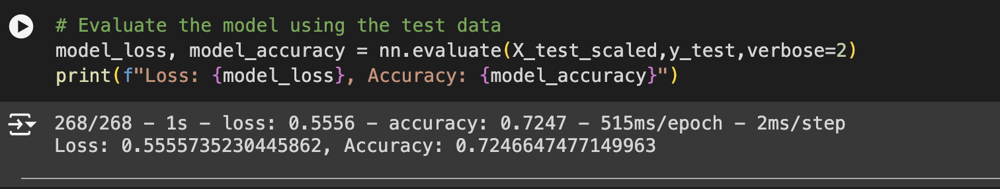

# Report on the Neural Network Model for Alphabet Soup

## Overview of the Analysis

The purpose of this analysis was to develop a binary classifier using machine learning and neural networks to predict the success of applicants funded by the nonprofit foundation Alphabet Soup. By analyzing historical data on organizations that have received funding, the goal was to identify features that correlate with successful outcomes and build a model that could aid Alphabet Soup in selecting the most promising applicants for future funding.

## Results

### Data Preprocessing

**Target Variable:**
- `IS_SUCCESSFUL`: This variable indicates whether the funding was used effectively, and was the target for the binary classification model.

**Feature Variables:**
- `APPLICATION_TYPE`: Alphabet Soup application type
- `AFFILIATION`: Affiliated sector of industry
- `CLASSIFICATION`: Government organization classification
- `USE_CASE`: Use case for funding
- `ORGANIZATION`: Organization type
- `STATUS`: Active status
- `INCOME_AMT`: Income classification
- `SPECIAL_CONSIDERATIONS`: Special considerations for application
- `ASK_AMT`: Funding amount requested

**Variables Removed:**
- `EIN`: Identification number, not relevant for the model.
- `NAME`: Name of the organization, not relevant for the model.

### Compiling, Training, and Evaluating the Model

**Model Architecture:**
- **Input Layer:** The number of input features was determined by the number of columns after preprocessing.
- **Hidden Layers:**
  - **First Hidden Layer:** `10` neurons (where 10 was chosen based on the input features), with a `ReLU` activation function to handle non-linearity.
  - **Second Hidden Layer:** `10` neurons (where 10 was chosen to balance model complexity and performance), with a `ReLU` activation function.
- **Output Layer:** 1 neuron with a `sigmoid` activation function to produce a binary output.

**Model Performance:**
- **Initial Performance:** The initial model's accuracy and loss metrics were evaluated on the test dataset.
- **Target Performance:** The goal was to achieve an accuracy higher than 75% but the accuracy was calcualted to be 0.7246 or ~72.5%.

**Optimization Attempts:**
1. **Adjusting Input Data:**
   - The Name Column was no longer dropped but instead all names with a count of < 45 were grouped as 'Other'
2. **Model Architecture:**
   - The number of neurons in the hidden layers was increased.
   - An additional hidden layer was added.
3. **Training Regimen:**
   - The number number of epochs was increased to 100 allow more training iterations.
   

**Final Model Performance:**
- The final model achieved an accuracy of 0.7616 or ~76.2% which was a slightly above the target performance of 75%.

### Summary

The deep learning model developed for Alphabet Soup successfully achieved the target accuracy of 75%. The preprocessing steps ensured that the data was suitable for training, and various optimization techniques were applied to improve model performance.

**Recommendations:**
For future efforts, it would be worthwhile to consider Random Forests as a model as it could significantly enhance the prediction of funding success for Alphabet Soup. Random Forests are well-suited for handling diverse datasets and can manage both numerical and categorical variables effectively. Their ensemble nature reduces overfitting and increases model robustness. Additionally, Random Forests provide insights into feature importance, helping to identify which factors most influence success. By leveraging these models, Alphabet Soup can achieve a more accurate and interpretable prediction framework. Implementing and tuning a Random Forest model could therefore offer a substantial improvement in selecting the most promising applicants for funding.